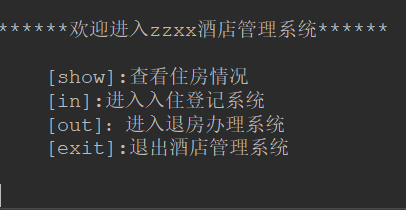

#HotelManagementSystem

author： Ranly
date：2019-3-24

KeyWord：`Java` `Objects` `class` `ManagementSystem`

--------------------------------------------

###1.相关类介绍
+ Room()
- HotelManagementSystem()
+ hotelSystemTest()

-----------------------------------

###2.相关方法及其成员变量介绍
> **Room()**
>  &ensp;&ensp;&ensp;|—— roomNum； //表示该房间的房间号
>  &ensp;&ensp;&ensp;|
>  &ensp;&ensp;&ensp;|—— tenantName； //表示房客的姓名
>  
> **成员变量详细介绍**
> |修饰符|变量类型|变量名|初始值|
> |:--------|:----------:|:-------:|-------:|
> |public|String|roomNum|null|
> |public|String|tenantName|null|
>

------------------------------------------

>####**HotelMannagementSystem()**
>&ensp;&ensp;&ensp;|——hotelName；     //表示酒店名字
>&ensp;&ensp;&ensp;|——maxSize；      //表示酒店的总房间数量
>&ensp;&ensp;&ensp;|——freeRoom；  //空余房间数量
>&ensp;&ensp;&ensp;|——rooms；      //Room()类数组，是房间的实例化数组
>&ensp;&ensp;&ensp;|——HotelManagementSystem()； //构造函数
>&ensp;&ensp;&ensp;|——clr()；//清屏函数
>&ensp;&ensp;&ensp;|——chooseInterface()； //页面跳转
>&ensp;&ensp;&ensp;|——mainInterface()； //主界面函数
>&ensp;&ensp;&ensp;|——in()； //住房登记系统
>&ensp;&ensp;&ensp;|——show()；  //显示出酒店的住房情况
>&ensp;&ensp;&ensp;|——out()；  //退房办理系统
>&ensp;&ensp;&ensp;|——exitSystem()； //退出系统函数
> **成员变量详细介绍**
> |修饰符|变量类型|变量名|初始值|
> |:--------|:----------:|:-------:|-------:|
> |public|String|hotelName|null|
> |public|int|maxSize|24|
> |public|int|freeRoom|24|
> |public|Room[]|rooms|null|
> **成员方法详细介绍**
> 
> #### HotelManagementSystem():
>+ 修饰符：public
>- 返回值：null
>+ 参数列表：String name
>- 功能：初始化实例
>####  clr():
>+ 修饰符：public
>+ 返回值：void
>+ 参数列表：null
>+ 功能：清屏
>#### chooseInterface():
>+ 修饰符：public
>+ 返回值：void
>+ 参数列表：null
>+ 功能：页面跳转函数，用来进行页面跳转
>#### mainInterface():
>+ 修饰符：public
>+ 返回值：void
>+ 参数列表：null
>+ 功能：用来跳转到主页面的函数
>#### in():
>+ 修饰符：public
>+ 返回值：void
>+ 参数列表：null
>+ 功能：用来实现入住登记的功能
>#### out():
>+ 修饰符：public
>+ 返回值：void
>+ 参数列表：null
>+ 功能：用来实现退房的功能
>#### show():
>+ 修饰符：public
>+ 返回值：void
>+ 参数列表：null
>+ 功能：用来查看酒店的住店情况
>#### exitSystem():
>+ 修饰符：public
>+ 返回值：void
>+ 参数列表：null
>+ 功能：用于退出酒店管理系统

----------------------------
###3.相关方法及其成员变量介绍
>####**相关界面图片**
>##### 主界面：
>
>---------------------------
>##### 入住登记界面
>
>---------------------------
>##### 退房办理界面
>
>----------------------
>##### 查看酒店房间界面
>
>---------------------

